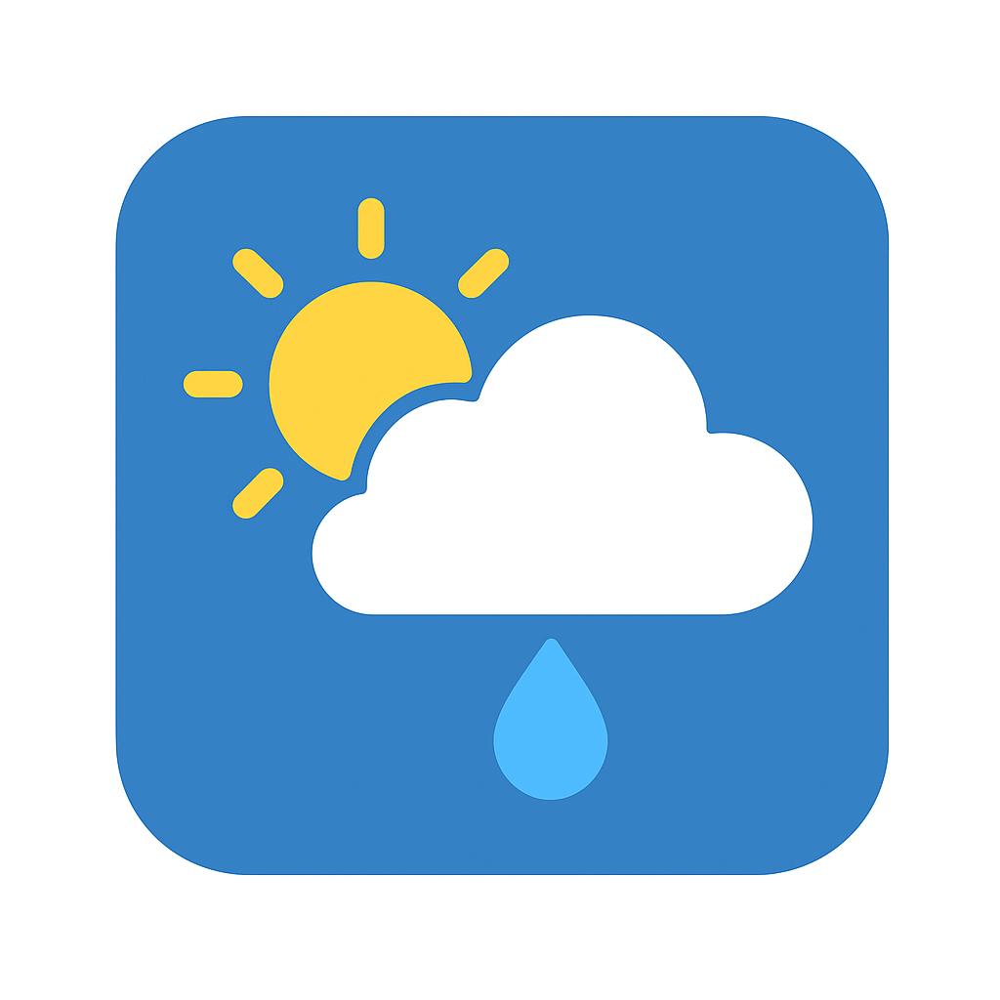

# 🌦️ Weather Portal

A clean, responsive **Weather Portal** that lets you search any city and view **current conditions** along with a **6-day forecast**. Built with **HTML, CSS, and JavaScript**, and powered by the **OpenWeather API**.



---

## ✨ Features
- 🌍 **Search by City** – Get real-time weather updates for any location.
- 📅 **6-Day Forecast** – See upcoming weather trends.
- 🌡 **Celsius ↔ Fahrenheit Toggle** – Switch temperature units seamlessly.
- 🌓 **Dark/Light Mode** – Toggle themes for comfortable viewing.
- 🕑 **Search History** – Quickly access your last 10 searched cities.
- ⚡ **Responsive UI** – Works smoothly across devices.
- 🔄 **Refresh Button** – Reload the page instantly.

---

## 🛠️ Tech Stack
- **Frontend:** HTML5, CSS3, JavaScript (Vanilla)
- **API:** [OpenWeather API](https://openweathermap.org/api)
- **Storage:** LocalStorage (for recent searches)

---

## 🚀 Getting Started

### 1️⃣ Clone the Repository
```bash
git clone https://github.com/Chandiran3122/weather-portal.git
cd weather-portal
```

### 2️⃣ Add Your API Key
Open `app.js` and replace the placeholder key:
```js
const apiKey = "YOUR_OPENWEATHER_API_KEY";
```

You can get a free API key from [OpenWeather](https://home.openweathermap.org/users/sign_up).

### 3️⃣ Run Locally
Simply open `index.html` in your browser.

Or use a local server (recommended):
```bash
# Using Python
python -m http.server 8000
```
Then visit: [http://localhost:8000](http://localhost:8000)

---

## 📂 Project Structure
```
.
├── index.html       # Main HTML page
├── style.css        # Stylesheet
├── app.js           # JavaScript (API calls, UI updates)
├── weathericon.png  # App favicon
└── README.md        # Project documentation
```

---

## 📸 Screenshots
### 🌞 Light Mode
(Add screenshot here)

### 🌙 Dark Mode
(Add screenshot here)

---

## 🌐 Deployment

### 🚀 GitHub Pages
1. Push your code to a GitHub repository.
2. Go to **Settings → Pages** in your repo.
3. Under **Source**, select `main` branch and `/ (root)` folder.
4. Click **Save**.
5. Your site will be live at:
   ```
   https://<your-username>.github.io/weather-portal/
   ```

### 🌍 Other Options
- **Netlify** – Drag & drop the repo, or connect GitHub repo.
- **Vercel** – One-click deploy from GitHub.
- **AWS Amplify** – For cloud hosting with CI/CD.

---

## 📜 License
This project is licensed under the **MIT License** – feel free to use and modify it.
